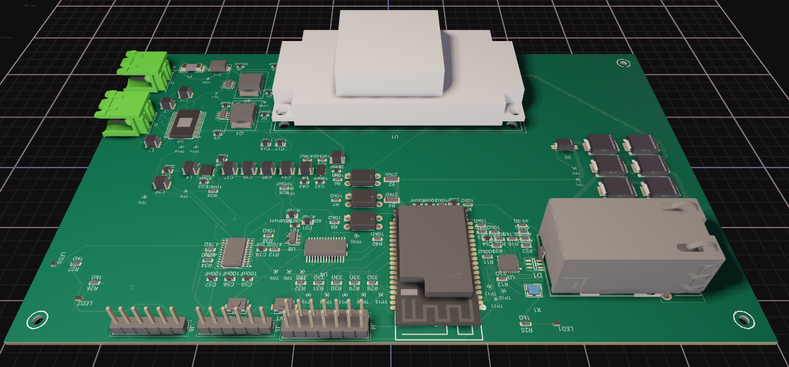
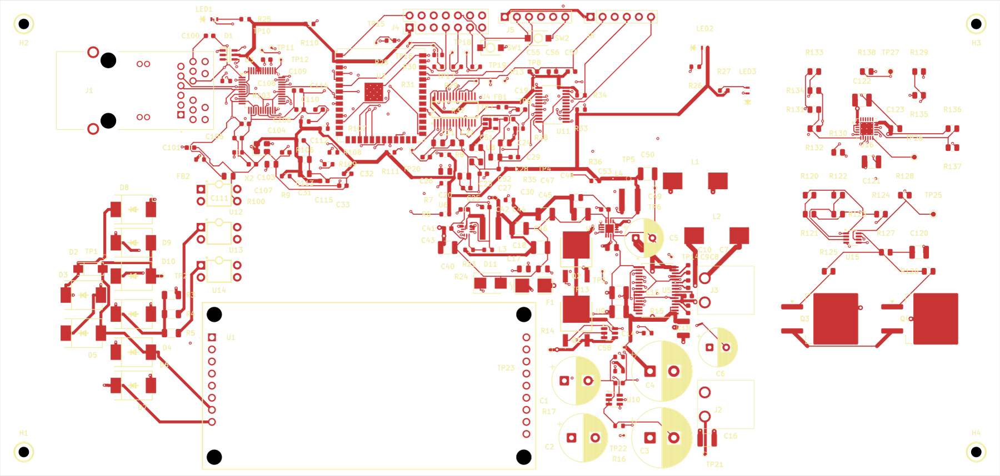

# ESP32 PoE Home Assistant Speaker

A PoE-powered network ceiling-speaker controller built around an **ESP32-S3**, **W5500 Ethernet**, **PCM5122 DAC**, and **TPA3116D2 amplifier**.

The long-term goal is a retrofit-friendly Home Assistant / voice-assistant speaker platform: reuse ordinary ceiling speakers, add network audio and control at the speaker, and optionally add a modular microphone-array ring hidden behind the existing grille.

## Project disclaimer

I'm not a hardware engineer — I'm an IT administrator who enjoys electronics, Home Assistant, and building things. I have a working understanding of many of the concepts involved, but this project has also been developed heavily with AI-assisted design, CAD scripting, and review.

I would genuinely welcome review or collaboration from experienced hardware engineers, especially as the project moves toward its first physical prototype.

This hardware is currently untested. It has not yet been fabricated, assembled, or electrically validated, and I cannot claim that the current design will work as intended. Please treat it as an engineering prototype, not a finished or proven product.



> **Earlier development render — the current Rev E hardware differs.**
>
> This image is included because it communicates the physical concept well; it is not the current placement, routing, or fabrication reference. See [project history](docs/HISTORY.md) and the active Rev E source below.

> **Engineering prototype — not ready to manufacture, install, or power up as a finished product.**
>
> The current hardware has not yet been fabricated, assembled, or electrically validated.

## Project status

| Area | Status |
| --- | --- |
| Main-board schematic / PCB | Rev E engineering review |
| KiCad source | Available directly in this repository |
| Saved ERC / DRC | Clean under the current saved rule profile |
| Ethernet layout | Review / rework still required |
| Power / protection | Engineering review still required |
| Audio / amplifier | Circuit and thermal validation still required |
| Firmware | Bring-up firmware not yet complete |
| Home Assistant integration | Planned, not yet validated |
| Microphone array | Modular ring concept defined; PCB not yet designed |
| Physical prototype | Not built yet |

A clean ERC/DRC result is a regression check, not proof that the circuit is electrically correct or fabrication-ready.

## Current hardware

The main board is intended to provide:

- ESP32-S3 controller
- wired Ethernet using W5500
- PoE-powered operation with bench-power support for development
- PCM5122 playback DAC
- TPA3116D2 speaker amplifier
- target of approximately **30 W into 4 ohms**, subject to real prototype validation
- programming / debug access
- expansion interfaces, including the reserved J4 microphone-ring connector

### Current Rev E board preview



The image above reflects the current Rev E board source more closely than the historical 3D render at the top of this README. The KiCad files remain the authoritative design reference.

### Open the Rev E design

The active source is tracked directly in Git:

- [Rev E KiCad project](hardware/PoE-Speaker/RevE/KiCad-RevE/PoE-Speaker-RevE.kicad_pro)
- [Rev E PCB](hardware/PoE-Speaker/RevE/KiCad-RevE/PoE-Speaker-RevE.kicad_pcb)
- [Rev E schematic](hardware/PoE-Speaker/RevE/KiCad-RevE/PoE-Speaker-RevE.kicad_sch)
- [Rev E engineering notes](hardware/PoE-Speaker/RevE/engineering/)
- [Historical design checkpoints](hardware/checkpoints/)

Open the project in **KiCad 10**. Keep the adjacent project-local footprint library, symbol library, tables, and design rules together.

## Modular microphone rings

A separate family of microphone-array rings is planned for retrofit installations. The idea is to select a ring diameter that fits behind an existing ceiling-speaker grille rather than designing a unique microphone system for every speaker model.

The first reference target is a nominal **8-inch ceiling speaker with an approximately 9-inch / 229 mm grille**. Ring Rev A is intended to target eight microphones and reserve space for visible listening / privacy status lighting behind the grille.

- [Microphone-ring concept](hardware/microphone-rings/README.md)
- [Listening / status-light plan](hardware/microphone-rings/LED-STATUS-LIGHT-PLAN.md)
- [Main-board J4 connector definition](hardware/PoE-Speaker/RevE/engineering/CONNECTOR-GUIDE.md)

Optional ring features are intended to use the existing J4 expansion interface rather than forcing repeated main-board redesigns.

## Engineering status and roadmap

The current release state is **HOLD** while the design is reviewed for first-prototype fabrication.

Highest-priority work includes:

1. Ethernet MDI differential-pair routing, reference continuity, termination / ESD geometry, and stackup assumptions.
2. PoE / bench input protection, startup, inrush, fault behavior, fuse coordination, and current-carrying paths.
3. PCM5122 / TPA3116D2 implementation, regulator behavior, grounding, output filtering, and thermal assumptions.
4. Footprint, courtyard, connector, heatsink, clearance, and assembly-process review.
5. Reproducible manufacturing outputs and a controlled prototype bring-up plan.

Project documents:

- [Roadmap](ROADMAP.md)
- [Engineering review guide](ENGINEERING-REVIEW.md)
- [Order / release review](ORDER-RELEASE-REVIEW.md)
- [Prototype validation plan](PROTOTYPE-VALIDATION.md)
- [Contribution guidance](CONTRIBUTING.md)
- [GitHub issues](https://github.com/74kumi/Esp32-Poe-HA-Speaker/issues)

## Repository layout

```text
.
├── docs/
│   ├── HISTORY.md
│   └── images/
│       └── early-board-render.png
├── hardware/
│   ├── PoE-Speaker/
│   │   └── RevE/
│   │       ├── KiCad-RevE/        # current editable board source
│   │       └── engineering/       # design reviews, calculations and scripts
│   ├── microphone-rings/          # future mic-array / status-light work
│   └── checkpoints/               # historical board revisions
├── ENGINEERING-REVIEW.md
├── ORDER-RELEASE-REVIEW.md
├── PROTOTYPE-VALIDATION.md
├── ROADMAP.md
└── board-top.png
```

## Contributing / reviewing

Engineering review is welcome, especially around Ethernet signal integrity, protection / fault behavior, power conversion, amplifier implementation, thermal design, footprints, and manufacturability.

When reporting a hardware finding, please include the affected revision, component / pin / net, location where practical, expected behavior, observed concern, and supporting datasheet section or calculation. Clearly distinguish confirmed defects from questions or suggested improvements.

See [CONTRIBUTING.md](CONTRIBUTING.md) for the current review priorities and main-board change policy.

This project has used AI-assisted CAD scripting and review workflows. AI output is not treated as engineering validation; independent review and physical prototype measurements are still required.

## License

Original hardware design materials are available for personal, educational, research, and other noncommercial use under the terms in [LICENSE](LICENSE).

Commercial manufacture, sale, OEM use, paid integration, or other commercial exploitation requires a separate written commercial license from the copyright holder.

Software, firmware, scripts, and third-party material may be subject to separate terms. Vendor references, library content, trademarks, and datasheets retain their respective owners' rights and notices.
